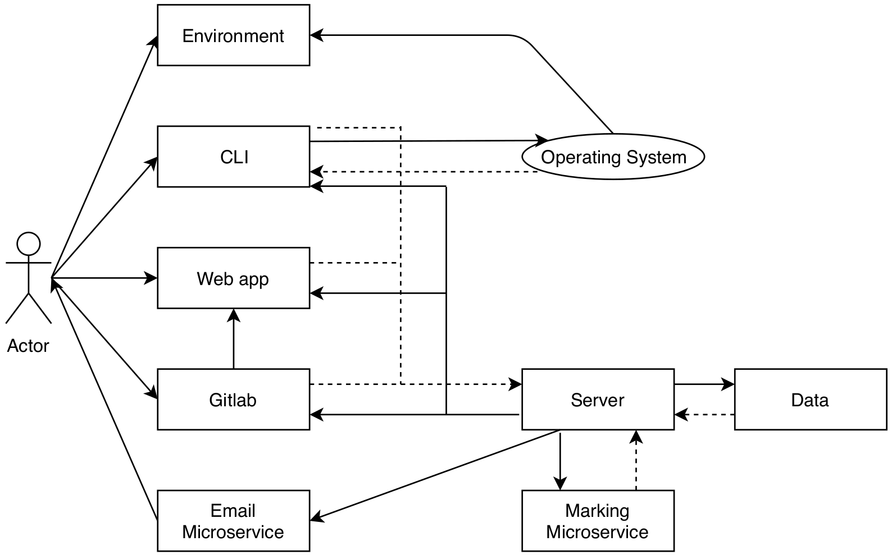

# Welcome to the Maties Assesment Management System
Try the [web app](https://hermes.cs.sun.ac.za)

To be given a profile on the webapp, please contact me via email.

## Introduction
At Stellenbosch University, Computer Science students spend a lot of their time
doing practical work. Managing this is a large task, and the existing solutions
are frustrating, which has led to the creation of numerous unofficial solutions.
Maintaining and using the current set of solutions is time consuming for lecturers
and markers that need to manage and mark large number of submissions that
come in many different forms.

The most used solution in the Computer Science Division is the SunLearn
platform. SunLearn is an effective system, but it over-complicates simple actions
by offering an excess of options, or requiring a user to switch between multiple
pages for simple actions. Submissions by a student is one such example of over-
complication. After a student moves between multiple pages to make or edit
a submission, it is often unclear whether a successful edit or submission has
been made. Another example is assignment creation by lecturers or markers.
SunLearn offers an large variety of options for assignments. However, these
options often do not suit the needs of lecturers in the Computer Science Division,
such as allowing GitLab to be an option for submissions or running a marking
script on all of the submissions for an assignment. This large variety can also
make finding the required options more difficult than it would be if all of the
unnecessary options were to be removed.

In addition, there is a lack of an isolated and configurable assessment envi-
ronment at Stellenbosch University. We are able to use Ubuntu test accounts
on the university lab computers for tests and assignments that require a fresh
and restricted environment. This solution is effective for separating students
from their home directories, but does not offer any extra features such as in-
ternet restrictions, adding directories with documentation, or allowing students
to save work done in the environment for future reference. Furthermore, the
current solution does not have any way of ensuring that a student is using the
environment.
## Overview

Below is a simple system diagram to discribe the different flows of the project.

## Repository Contents

The **Flask** directory contains all of the functionality of the webapp that serves this project.

The **VM** directory contains basic scripts and information to handle the virtual box environment.

The **CLI** directory contains the scripts and applications required to use the system through the command line.

The **Git** directory contains the instructions on how to run a local gitlab server and runner. It also contains scripts that illustrate simple gitlab API use cases.

The **Testing** Directory contains all testing functionality as well as the files required.

The **Documents** directory contains all of the documentation associated with the planning, implementation and testing of the project.

The **Planning** directory contains images that illustrate the planning of the architecture of the project.

The **Willems_sources** directory contains parts of an existing system created by Willem Bester that were used for inspiration and testing in the early stages of the project.
